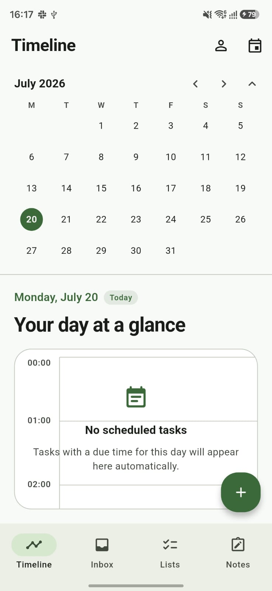

# Noted - Day Planner | GitHub Pages Website

Official website for **Noted - Day Planner**, an all-in-one productivity Android application by **Holokraft Consulting Services (OPC) Pvt Ltd** (Developer: Holokraft Apps).

> **Tagline:** Plan today. Achieve tomorrow.

---

## 🚀 Live Website

**URL:** https://holokraftinc.github.io/noted/

---

## 📁 Project Structure

```
/
├── index.html              # Home / Landing page
├── about.html              # About Holokraft Apps
├── privacy.html            # Privacy Policy (Google Play & GDPR compliant)
├── terms.html              # Terms of Service
├── support.html            # Help Center & How-To guides
├── contact.html            # Contact form & info
├── delete-account.html     # Account deletion page (Google Play required)
├── robots.txt              # Search engine crawl rules
├── sitemap.xml             # XML sitemap for SEO
├── README.md               # This file
└── assets/
    ├── css/
    │   └── style.css       # All styles (single file, no dependencies)
    ├── js/
    │   └── script.js       # All JavaScript (vanilla, no frameworks)
    └── images/
        ├── favicon.svg     # SVG favicon (works in all modern browsers)
        ├── og-image.svg    # Open Graph / social share image
        └── screenshots/   # Place app screenshots here (see below)
```

---

## 🌐 Deploying to GitHub Pages

### Option A — Deploying from a dedicated repository (Recommended)

1. **Create a GitHub repository** named `noted` (or your preferred name) under your GitHub organisation/account.

2. **Clone this project** and push it to that repository:
   ```bash
   git init
   git add .
   git commit -m "Initial commit: Noted website"
   git remote add origin https://github.com/holokraftinc/noted.git
   git push -u origin main
   ```

3. **Enable GitHub Pages:**
   - Go to your repository on GitHub.
   - Click **Settings** → **Pages** (left sidebar).
   - Under **Source**, select **Deploy from a branch**.
   - Choose **Branch: main**, **Folder: / (root)**.
   - Click **Save**.

4. **Your site will be live** at:
   `https://holokraftinc.github.io/noted/`
   (Replace `holokraftinc` with your GitHub username/organisation.)

5. GitHub Pages may take 1–5 minutes to build and deploy on the first push.

### Option B — Deploying from the `gh-pages` branch

If you want to keep the website separate from your main code:

1. Create a branch called `gh-pages`:
   ```bash
   git checkout -b gh-pages
   git push origin gh-pages
   ```

2. In repository Settings → Pages, set source to the `gh-pages` branch.

### Option C — Deploying under a custom domain

1. Add a `CNAME` file to the root of this project containing your domain:
   ```
   noted.holokraftinc.com
   ```

2. Configure your DNS to point to GitHub Pages servers (follow the [GitHub Pages custom domain guide](https://docs.github.com/en/pages/configuring-a-custom-domain-for-your-github-pages-site)).

3. Enable HTTPS in GitHub Pages settings after DNS propagates.

---

## ✏️ Editing Pages

All pages are plain HTML files — no build tools, no frameworks, no Node.js required.

### To edit any page:

1. Open the `.html` file in any text editor (VS Code recommended).
2. Find the section you want to change using browser DevTools or Ctrl+F.
3. Edit the text/HTML content directly.
4. Save and commit the file to GitHub.

### Key sections and where to find them:

| Section | File | What to look for |
|---|---|---|
| Hero headline | `index.html` | `<section class="hero">` |
| Features list | `index.html` | `<section id="features">` |
| FAQ | `index.html` | `<section id="faq">` |
| About company | `about.html` | `<section class="section-pad">` |
| Roadmap | `about.html` | `<div class="roadmap">` |
| Privacy sections | `privacy.html` | Each `<section class="legal-section">` |
| Terms sections | `terms.html` | Each `<section class="legal-section">` |
| Support guides | `support.html` | `<div class="card" id="how-*">` |
| Contact info | `contact.html` | `<div class="contact-info-card">` |
| Deletion steps | `delete-account.html` | `<div class="delete-steps">` |

---

## 🔗 Updating the Google Play Link

All "Get the App" / "Download on Google Play" buttons link to:
```
https://play.google.com/store/apps/details?id=com.noted.app
```

To update this link (e.g. once your app is live), search for `play.google.com/store/apps/details?id=com.noted.app` across all HTML files and replace with the correct URL.

**Quick command using sed (macOS/Linux):**
```bash
find . -name "*.html" -exec sed -i '' \
  's|https://play.google.com/store/apps/details?id=com.noted.app|YOUR_ACTUAL_PLAY_STORE_URL|g' {} \;
```

---

## 📧 Updating Email Addresses

The following placeholder email addresses are used throughout the site. Replace them with real addresses before going live:

| Placeholder | Used for | Files |
|---|---|---|
| `support@holokraftinc.com` | App support, bug reports | All pages |
| `privacy@holokraftinc.com` | Data/privacy requests, GDPR | `privacy.html`, `delete-account.html`, `contact.html` |
| `hello@holokraftinc.com` | Business inquiries | `contact.html` |
| `legal@holokraftinc.com` | Legal inquiries | `terms.html` |

---

## 🖼️ Adding App Screenshots

1. Export screenshots from your Android device or design tool.
2. Name them descriptively: `timeline.png`, `tasks.png`, `notes.png`, etc.
3. Place them in `assets/images/screenshots/`.
4. Update the screenshot placeholders in `index.html` — find `<div class="screenshot-item">` sections and replace the placeholder `<div class="screenshot-placeholder">` with an `` tag:

```html
<!-- Replace this: -->
<div class="screenshot-item" role="listitem">
  <div class="screenshot-placeholder">
    <svg>...</svg>
    <span>Timeline View</span>
  </div>
</div>

<!-- With this: -->
<div class="screenshot-item" role="listitem">
  
</div>
```

**Recommended screenshot dimensions:** 1080×2340px (portrait, 9:19 ratio)

---

## 🎨 Customising Branding & Colors

All colors and design tokens are CSS custom properties defined at the top of `assets/css/style.css`:

```css
:root {
  --primary:        #335C4A;   /* Main brand green */
  --primary-dark:   #264538;   /* Darker green for hover states */
  --primary-light:  #4A7A62;   /* Lighter green */
  --secondary:      #F8F7F2;   /* Off-white background */
  --accent:         #6E8B74;   /* Muted green accent */
  --accent-light:   #E8F0EA;   /* Very light green for backgrounds */
  /* ... */
}
```

To change the brand color, update `--primary`, `--primary-dark`, and `--primary-light`. The entire website will update automatically.

---

## 📜 Updating Legal Pages

### Privacy Policy (`privacy.html`)
The Privacy Policy is written to satisfy:
- Google OAuth Verification requirements
- Google Play Store policy
- GDPR (EU)
- CCPA (California)
- Indian IT Act compliance

**When to update:**
- When you add new third-party SDKs (e.g. Firebase Analytics, Crashlytics)
- When you add new data collection (e.g. location, contacts)
- When you launch a web version or iOS version
- When you add paid features or subscriptions

Always update the "Last updated" date in the `<p class="page-hero-meta">` tag.

### Terms of Service (`terms.html`)
Update when:
- You launch paid/subscription features (update Section 14)
- You add team/collaborative features
- You change your governing law or dispute resolution process

### Delete Account Page (`delete-account.html`)
This page is **required by Google Play policy**. Do not remove it. Update it if:
- The in-app deletion steps change
- Your data retention timeline changes
- You add new data types

---

## 📊 SEO Checklist

Every page includes:
- [x] `<title>` tag with keyword-rich content
- [x] `<meta name="description">` (under 160 chars)
- [x] `<meta name="robots" content="index, follow">`
- [x] `<link rel="canonical">` — **Update domain before going live**
- [x] Open Graph tags (`og:title`, `og:description`, `og:image`, `og:url`)
- [x] Twitter Card tags
- [x] Structured Data (JSON-LD) on home and about pages
- [x] `sitemap.xml` — **Update `<lastmod>` dates when you make changes**
- [x] `robots.txt`
- [x] Semantic HTML with proper heading hierarchy
- [x] ARIA labels on interactive elements
- [x] Alt text on all images

**Before going live — update these URLs in every file:**
```
https://holokraftinc.github.io/noted/
```
Replace with your actual GitHub Pages URL if different.

---

## ♿ Accessibility Features

- Semantic HTML5 elements (`<nav>`, `<main>`, `<header>`, `<footer>`, `<section>`, `<article>`)
- ARIA labels on navigation, buttons, and form elements
- Keyboard-navigable mobile menu
- Focus-visible outlines (inherit from browser defaults)
- Sufficient color contrast (primary green on white passes WCAG AA)
- `role` attributes on menus and list items
- Screen-reader-hidden decorative elements (`aria-hidden="true"`)

---

## ⚡ Performance

- **No JavaScript frameworks** — vanilla JS only (~4KB minified)
- **No CSS frameworks** — custom CSS only (~12KB)
- **Single CSS file** — one HTTP request for all styles
- **Single JS file** — one HTTP request for all scripts
- **Google Fonts** with `preconnect` for faster loading
- **`loading="lazy"`** — add to all `` tags in screenshot sections
- **SVG favicon** — scales perfectly at all sizes, tiny file size
- **No external dependencies** beyond Google Fonts

---

## 🛠️ Local Development

No build tools are required. Open any HTML file directly in a browser, or use a simple local server:

```bash
# Python (built-in)
python3 -m http.server 8080

# Node.js (npx)
npx serve .

# VS Code — install the "Live Server" extension
# Right-click index.html → Open with Live Server
```

Then open `http://localhost:8080` in your browser.

---

## 📋 Pre-Launch Checklist

Before submitting the URL to Google Play / Google OAuth:

- [ ] Replace all `holokraftinc.github.io/noted/` with your actual live URL
- [ ] Replace placeholder email addresses with real ones
- [ ] Add your actual Google Play Store link
- [ ] Add real app screenshots to `assets/images/screenshots/`
- [ ] Replace `og-image.svg` with a proper 1200×630 PNG (`og-image.png`)
- [ ] Update `sitemap.xml` `<lastmod>` dates
- [ ] Test all pages on mobile (Android & iPhone viewport sizes)
- [ ] Test all navigation links
- [ ] Test the contact form (connect to a real backend or Formspree)
- [ ] Verify Privacy Policy URL matches what's entered in Google Play Console
- [ ] Verify Delete Account page URL matches what's entered in Google Play Console
- [ ] Submit sitemap to Google Search Console

---

## 📄 Licence

Website content and design copyright © 2024–2025 Holokraft Consulting Services (OPC) Pvt Ltd. All rights reserved.

The Noted - Day Planner app and all associated intellectual property are proprietary to Holokraft Consulting Services (OPC) Pvt Ltd.

---

## 📬 Contact

**Developer:** Holokraft Apps  
**Company:** Holokraft Consulting Services (OPC) Pvt Ltd  
**Support:** support@holokraftinc.com  
**Website:** https://holokraftinc.github.io  
**GitHub:** https://github.com/holokraftinc  
**Google Play:** https://play.google.com/store/apps/details?id=com.noted.app
